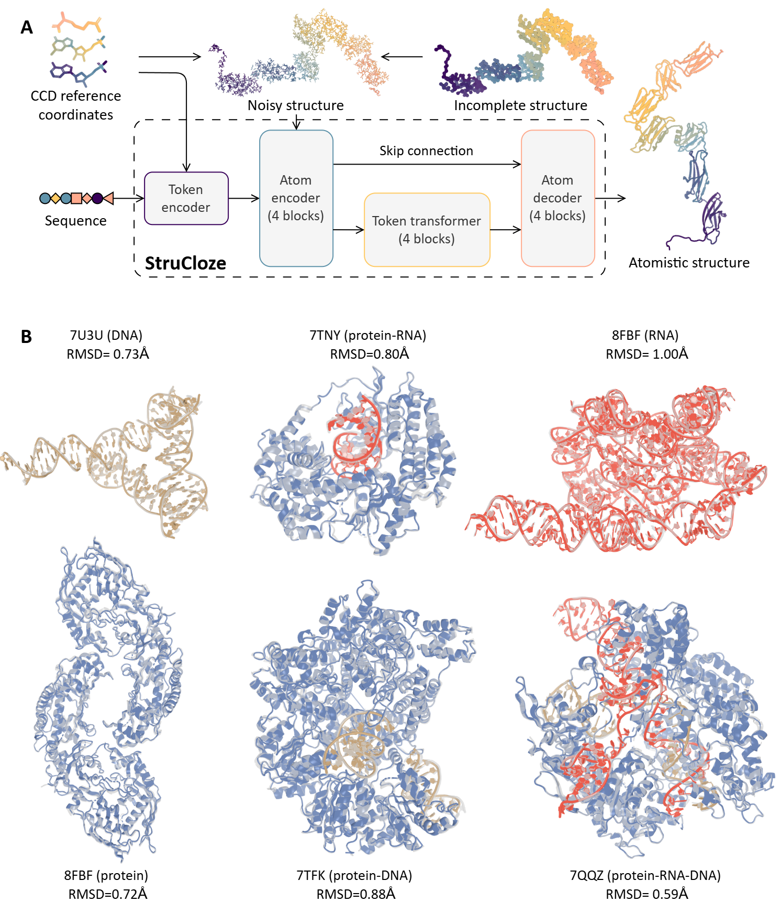

# Completing Any Missing Structural Elements in Biomolecules with StruCloze
<a href="https://pytorch.org/get-started/locally/"></a>
<a href="https://hydra.cc/"></a>
[](https://www.biorxiv.org/content/10.1101/2024.05.05.592611v2)

This repository contains code for "**Completing Any Missing Structural Elements in Biomolecules with StruCloze**", which raise a unified framework for back-mapping coarse-grained structures and completing missing residues, nucleotides in existing experimental structures.



### Table of contents

* Installation
* Dataset downloading **[Optional]** 
* Usage
  * Back-mapping coarse-grained structures
  * Completing missing tokens
* Analyzing predicted structures
* Some existing bugs
* Contact
* Acknowledgement

------

### Installation

Conda is recommended for setting up dependencies. To quickly set up an environment, run:

```bash
# Clone this repository and set up virtual environment
git clone https://github.com/Junjie-Zhu/StruCloze.git
cd StruCloze

# Create and activate environment
conda env create -f strucloze.yaml
source activate strucloze

# Install strucloze as a package.
pip install -e .
```

### Dataset downloading

We have uploaded our training and test dataset to Zenodo. Training set contains `52,926` processed entries from PDB (in format `.pkl.gz`)


### Usage

#### Back-mapping coarse-grained structures

#### Completing missing tokens

### Analyzing predicted structures

### Some existing bugs

Currently there are some known bugs in code listed here:

*  The `OXT` atom at the C-terminus is neglected in the prediction for convenience (As all other residues do not contain this atom, we remove it from CCD dictionary).
*  Chain IDs in predicted structures starts from `a` but not `A`.

Any suggestions or bug reports are welcome. Please open an issue in the GitHub repository.

### Contact
If you have any questions, please contact me via email: shiroyuki@sjtu.edu.cn
Or open an issue in the GitHub repository.

### Acknowledgement

